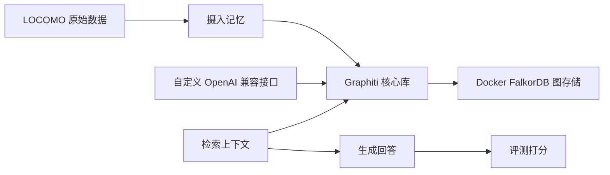

# LOCOMO 自托管 Graphiti 全链路部署说明

本文档说明如何用当前 `graphiti` 项目、Docker 版 FalkorDB 或其他支持的图存储，以及你自己的 OpenAI 兼容接口跑通 LOCOMO 数据集评测流程。

这里的目标不是直接使用 Zep Cloud，而是把 Zep Cloud 的 LOCOMO 评测流程迁移成自托管 Graphiti 流程。你后续可以基于这套流程再封装成接口服务，供远程评测程序调用。

参考的原始 Zep Cloud 脚本：

- 摄入记忆：`[zep_locomo_ingestion.py](https://github.com/youyane1-cmd/zep-papers/blob/main/kg_architecture_agent_memory/locomo_eval/zep_locomo_ingestion.py)`
- 检索上下文：`[zep_locomo_search.py](https://github.com/youyane1-cmd/zep-papers/blob/main/kg_architecture_agent_memory/locomo_eval/zep_locomo_search.py)`
- 生成回答：`[zep_locomo_responses.py](https://github.com/youyane1-cmd/zep-papers/blob/main/kg_architecture_agent_memory/locomo_eval/zep_locomo_responses.py)`
- 评测打分：`[zep_locomo_eval.py](https://github.com/youyane1-cmd/zep-papers/blob/main/kg_architecture_agent_memory/locomo_eval/zep_locomo_eval.py)`


## 1. 整体架构




原来的 Zep Cloud 流程中，`group.add` 用来注册分组，`graph.add` 用来写入记忆。

迁移到自托管 Graphiti 后，不需要单独调用 `group.add`。只要写入 episode 时传入 `group_id`，Graphiti 就会按这个 `group_id` 隔离图谱数据。

可以理解成：

```text
LOCOMO 用户 0 -> group_id = locomo_experiment_user_0
LOCOMO 用户 1 -> group_id = locomo_experiment_user_1
LOCOMO 用户 2 -> group_id = locomo_experiment_user_2
```

检索时也带上对应的 `group_id`，就不会把不同用户或不同对话的数据混在一起。

## 2. 需要准备的组件

你需要准备这几部分：

- 图存储：Windows 本地默认推荐 Docker 版 `FalkorDB`，用来存储 Graphiti 抽取出的实体、关系、事实、时间信息和索引。
- `graphiti_core`：当前仓库里的 Graphiti 核心库。
- 自定义 LLM 接口：需要兼容 OpenAI 的 `/v1/chat/completions`。
- 自定义 embedding 接口：需要兼容 OpenAI 的 `/v1/embeddings`。
- LOCOMO 数据集：脚本会从 `snap-research/locomo` 下载 `locomo10.json`。


## 3. 启动 Docker FalkorDB

Graphiti 不是把记忆直接写进 JSON 文件，而是把 LOCOMO 对话解析成图结构，再写入 FalkorDB。

大概结构是：

```text
locomo.json
  -> Graphiti 读取原始对话
  -> LLM 抽取实体、关系、事实、时间
  -> embedding 模型生成向量
  -> FalkorDB 保存图谱和索引
  -> 后续检索、问答都查 FalkorDB
```

在仓库根目录安装接口服务依赖：

```powershell
uv sync --extra locomo
```

先确认 Docker Desktop 已安装并启动：

```powershell
docker --version
```

如果这里提示无法识别 `docker`，说明当前系统还没有可用的 Docker 命令。需要先安装 Docker Desktop，启动 Docker Desktop 后重新打开 PowerShell。

启动 FalkorDB：

```powershell
docker run `
  --name falkordb `
  -p 6379:6379 `
  -v falkordb-data:/data `
  falkordb/falkordb:latest
```

第一次运行时 Docker 会自动下载 `falkordb/falkordb` 镜像。你不需要去网页上手动下载安装包。

这里的 `-v falkordb-data:/data` 是持久化配置。数据会写进 Docker 的命名卷 `falkordb-data`，不是写进 `examples/locomo/data/locomo.json`。

`.env` 里使用：

```env
GRAPH_BACKEND=falkordb
FALKORDB_HOST=localhost
FALKORDB_PORT=6379
FALKORDB_DATABASE=graphiti_memory
FALKORDB_USERNAME=
FALKORDB_PASSWORD=
```

如果以后再次启动同一个容器：

```powershell
docker start falkordb
```

脚本连接 FalkorDB 成功后，会自动创建 Graphiti 需要的索引和约束，并把 LOCOMO 数据写入图数据库。

## 4. 环境配置

在仓库根目录安装依赖：

```powershell
uv sync --extra locomo
```

`examples/locomo/.env.example` 是配置模板，`examples/locomo/.env` 是你本地真正使用的配置文件。如果 `.env` 不存在，可以从模板复制一份：

```powershell
Copy-Item examples\locomo\.env.example examples\locomo\.env
```

`Copy-Item` 是 PowerShell 的复制命令，作用是把 `.env.example` 复制成 `.env`。这样做是为了避免把真实 API key 写进模板文件。

默认推荐的 `.env` 应该类似这样：

```env
GRAPH_BACKEND=falkordb
FALKORDB_HOST=localhost
FALKORDB_PORT=6379
FALKORDB_DATABASE=graphiti_memory
FALKORDB_USERNAME=
FALKORDB_PASSWORD=

OPENAI_API_KEY=dummy
OPENAI_BASE_URL=http://10.112.86.11:80/v1

LLM_MODEL=your-chat-model
SMALL_LLM_MODEL=your-chat-model
CROSS_ENCODER_MODEL=gpt-4.1-nano
EMBEDDING_MODEL=your-embedding-model
EMBEDDING_DIM=1024

STRUCTURED_OUTPUT_MODE=json_schema
```

你还需要确认这几个值：

- `GRAPH_BACKEND`：保持 `falkordb`。
- `FALKORDB_HOST`：保持 `localhost`。
- `FALKORDB_PORT`：保持 `6379`，要和 Docker 端口映射一致。
- `FALKORDB_DATABASE`：FalkorDB 里的 graph 名字，默认使用 `graphiti_memory`，可按环境覆盖。
- `LLM_MODEL`：你的接口支持的聊天模型名。
- `SMALL_LLM_MODEL`：小任务模型名，可以先和 `LLM_MODEL` 一样。
- `CROSS_ENCODER_MODEL`：事实重排模型，必须支持 `logit_bias`、`logprobs` 和
  `top_logprobs`；推荐 `gpt-4.1-nano`。
- `EMBEDDING_MODEL`：你的接口支持的 embedding 模型名。
- `EMBEDDING_DIM`：embedding 模型输出维度，必须填真实维度，比如 `768`、`1024`、`1536`。
- `STRUCTURED_OUTPUT_MODE`：如果你的模型不稳定支持 `json_schema`，可以改成 `json_object`。


## 5. 阶段一：摄入记忆

原始 Zep Cloud 写入逻辑是：

```python
await zep.group.add(group_id=group_id)
await zep.graph.add(
    data=msg.get('speaker') + ': ' + msg.get('text') + img_description,
    type='message',
    created_at=iso_date,
    group_id=group_id,
)
```

迁移到 Graphiti 后，对应逻辑是：

```python
await graphiti.add_episode(
    name=f'locomo_user_{group_idx}_session_{session_idx}_msg_{msg_idx}',
    episode_body=f'{speaker}: {text}{img_description}',
    source=EpisodeType.message,
    source_description='LOCOMO message',
    reference_time=date_string,
    group_id=group_id,
)
```

当前实现脚本是：

```text
examples/locomo/locomo_ingestion.py
```

运行前，直接修改脚本顶部常量：

```python
ENV_PATH = EXAMPLE_DIR / '.env'
DATA_URL = DEFAULT_LOCOMO_URL
DATA_PATH = EXAMPLE_DIR / 'data' / 'locomo.json'
NUM_USERS = 10
MAX_SESSION_COUNT = 35
GROUP_PREFIX = 'locomo_experiment_user'
FORCE_DOWNLOAD = False
BUILD_INDICES = True
```

如果只是先跑一个用户做测试：

```python
NUM_USERS = 1
```

运行摄入脚本：

```powershell
uv run python -m examples.locomo.locomo_ingestion
```

运行后会发生这些事：

- 下载 LOCOMO 数据到 `examples/locomo/data/locomo.json`。
- 每个 LOCOMO 用户生成一个 `group_id`。
- 每条对话消息写成一个 `EpisodeType.message`。
- Graphiti 调用你的 LLM 和 embedding 接口抽取图谱。
- 抽取后的节点、边、事实和向量写入 Docker FalkorDB 容器里的 `graphiti_memory` 这张 graph。
- `graphiti_memory` 里不是每个用户单独一张图，而是所有节点和边都带 `group_id` 属性；检索时用 `group_ids=[...]` 过滤。

注意：外部接口中同一个 `user_id` 的消息必须顺序写入，不要并发写入。服务内部会将
`user_id` 映射为 Graphiti 的 `group_id`。

## 6. 阶段二：检索上下文

原始 Zep Cloud 检索脚本会同时检索节点和边：

```python
search_results = await asyncio.gather(
    zep.graph.search(query=query, group_id=group_id, scope='nodes', reranker='rrf', limit=20),
    zep.graph.search(query=query, group_id=group_id, scope='edges', reranker='cross_encoder', limit=20),
)
```

Graphiti 基础检索写法：

```python
facts = await graphiti.search(query, group_ids=[group_id], num_results=20)
```

Graphiti 高级检索写法：

```python
results = await graphiti.search_(
    query,
    config=COMBINED_HYBRID_SEARCH_RRF,
    group_ids=[group_id],
)
```

当前实现脚本是：

```text
examples/locomo/locomo_retrieval_eval.py
```

运行前，直接修改脚本顶部常量：

```python
ENV_PATH = EXAMPLE_DIR / '.env'
GROUP_ID = 'locomo_experiment_user_0'
QUERIES = [
    'What important facts are known about this user?',
]
TOP_K = 10
USE_ADVANCED_SEARCH = False
```

如果要查另一个用户，就改 `GROUP_ID`：

```python
GROUP_ID = 'locomo_experiment_user_1'
```

如果要使用高级检索，就改：

```python
USE_ADVANCED_SEARCH = True
```

运行检索脚本：

```powershell
uv run python -m examples.locomo.locomo_retrieval_eval
```

后续给回答模型的上下文建议组织成这种形式：

```text
相关事实：
- <fact> (event_time: <valid_at>)

相关实体：
- <entity_name>: <entity_summary>
```


## 7. 阶段三：生成回答

原始 `zep_locomo_responses.py` 的逻辑是：

1. 读取 LOCOMO 的问题。
2. 读取检索阶段保存的上下文。
3. 把上下文和问题一起发给 LLM。
4. 得到生成回答。
5. 保存问题、生成回答、标准答案和耗时。

后续迁移到 Graphiti 服务时，回答逻辑可以写成这样：

```python
async def answer_question(llm_client, context: str, question: str) -> str:
    system_prompt = '你是一个基于记忆上下文回答问题的助手。'

    prompt = f'''
    你可以使用下面的记忆上下文回答问题。

    要求：
    1. 只根据给定上下文回答。
    2. 注意时间戳。
    3. 如果记忆之间有冲突，优先使用较新的记忆。
    4. 如果问题涉及相对时间，要尽量转换成具体日期、月份或年份。
    5. 回答要具体，不要泛泛而谈。

    上下文：
    {context}

    问题：{question}
    回答：
    '''

    response = await llm_client.chat.completions.create(
        model='your-chat-model',
        messages=[
            {'role': 'system', 'content': system_prompt},
            {'role': 'user', 'content': prompt},
        ],
        temperature=0,
    )
    return response.choices[0].message.content or ''
```

当前接口服务已经把“检索 + 回答”合并成一个接口：

```text
POST /memory/response
```


## 8. 阶段四：评测打分

原始 `zep_locomo_eval.py` 的逻辑是：

1. 读取生成回答。
2. 读取 LOCOMO 标准答案。
3. 调用一个打分 LLM 判断生成回答是否正确。
4. 统计正确率。

打分逻辑可以写成这样：

```python
async def grade_answer(
    llm_client,
    question: str,
    golden_answer: str,
    generated_answer: str,
) -> bool:
    prompt = f'''
    你需要判断生成回答是否匹配标准答案。

    问题：{question}
    标准答案：{golden_answer}
    生成回答：{generated_answer}

    判断规则：
    1. 如果生成回答和标准答案表达的是同一件事，判为 CORRECT。
    2. 如果是时间问题，只要指向同一日期、月份或时间段，就判为 CORRECT。
    3. 如果明显答非所问，判为 WRONG。

    只返回 CORRECT 或 WRONG。
    '''

    response = await llm_client.chat.completions.create(
        model='your-chat-model',
        messages=[{'role': 'user', 'content': prompt}],
        temperature=0,
    )
    label = (response.choices[0].message.content or '').strip().lower()
    return label == 'correct'
```

建议先把打分作为离线脚本跑通。等摄入、检索、回答都稳定后，再封装成接口：

```text
POST /memory/evaluate
```


## 9. 本地接口服务

接口服务脚本：

```text
examples/locomo/main_server.py
```

推荐用 Docker Compose 一起启动 FalkorDB + API：

```bash
cd examples/locomo
docker compose up --build -d
```

Compose 宿主机端口：

| 服务 | 地址 |
| --- | --- |
| memory API | `http://服务器IP:18003` |
| FalkorDB 数据库 | `服务器IP:18004` |

本机不用 Docker 时：

```powershell
uv sync --extra locomo
uv run python examples/locomo/main_server.py
```

也可以直接使用 Uvicorn 启动（默认 `8000`）：

```powershell
uv run uvicorn examples.locomo.main_server:app --host 0.0.0.0 --port 8000
```

远端请求体只需要传业务数据，不需要传 OpenAI、embedding、FalkorDB 连接参数。这些参数都从 `examples/locomo/.env` 读取。

详细接口字段说明见：

```text
examples/locomo/API_USAGE.md
```

当前接口一览：

| 方法 | 路径 | 作用 |
| --- | --- | --- |
| `GET` | `/health` | 健康检查 |
| `POST` | `/memory/add` | 写入消息到图谱 |
| `POST` | `/memory/delete` | 按 `user_id` 清库 |
| `POST` | `/memory/search` | 检索记忆 |
| `POST` | `/memory/response` | 检索并生成回答 |
| `GET` | `/memory/graph` | 拉取某个 `user_id` 的节点和边（JSON） |
| `GET` | `/memory/ui` | 浏览器可视化查看图谱 |

说明：FalkorDB 自带 Browser UI 在当前国内镜像里可能不可用；可视化请用 `/memory/ui`。

### `GET /health`

作用：检查服务是否就绪。

```bash
curl http://服务器IP:18003/health
```

响应示例：

```json
{
  "status": "ok"
}
```

### `POST /memory/add`

作用：注册并写入一个用户的一批消息。服务端会按 `messages` 顺序循环调用
`graphiti.add_episode(...)`，将 `user_id` 映射为内部 `group_id`，并记录注册进度。

请求示例：

```json
{
  "user_id": "locomo_experiment_user_0",
  "messages": [
    {
      "session_idx": 1,
      "msg_idx": 0,
      "speaker": "Caroline",
      "content": "Hey Mel! Good to see you! How have you been?",
      "timestamp": "2023-05-08T13:56:00Z"
    }
  ],
  "source_description": "LOCOMO message"
}
```

服务端内部转换：

```text
group_id       <- user_id
episode_name   <- {user_id}_session_{session_idx}_msg_{msg_idx}
episode_body   <- "{speaker}: {content}"
reference_time <- timestamp
```

响应示例：

```json
{
  "user_id": "locomo_experiment_user_0",
  "ingested_count": "1/1",
  "duration_ms": 1234.5,
  "input_tokens": 1000,
  "output_tokens": 200,
  "total_tokens": 1200
}
```

### `POST /memory/delete`

作用：按 `user_id` 删除该用户的全部 Graphiti 图谱数据，并删除本地注册进度文件。

请求示例：

```json
{
  "user_id": "locomo_experiment_user_0"
}
```

响应示例：

```json
{
  "user_id": "locomo_experiment_user_0",
  "deleted": true,
  "progress_deleted": true
}
```

### `POST /memory/search`

作用：给定 `user_id` 和 `queries` 数组，从 Graphiti 检索相关事实和实体。

请求示例：

```json
{
  "user_id": "locomo_experiment_user_0",
  "queries": [
    "What important facts are known about this user?"
  ]
}
```

响应示例：

```json
{
  "user_id": "locomo_experiment_user_0",
  "duration_ms": 456.7,
  "input_tokens": 1000,
  "output_tokens": 20,
  "total_tokens": 1020,
  "results": [
    {
      "query": "What important facts are known about this user?",
      "context": "FACTS and ENTITIES ...",
      "duration_ms": 123.4,
      "facts": [
        {
          "uuid": "fact-uuid",
          "fact": "The user bought a shell necklace in Hawaii.",
          "valid_at": "2024-01-01T12:00:00Z",
          "invalid_at": null
        }
      ],
      "nodes": [
        {
          "uuid": "node-uuid",
          "name": "Caroline",
          "summary": "Caroline is one speaker in the conversation."
        }
      ]
    }
  ]
}
```

### `POST /memory/response`

作用：先按 `user_id` 检索相关事实，再调用本地 `.env` 里配置的 LLM 生成回答。

请求示例：

```json
{
  "user_id": "locomo_experiment_user_0",
  "qa": [
    {
      "question": "What did the user buy in Hawaii?"
    }
  ]
}
```

响应示例：

```json
{
  "user_id": "locomo_experiment_user_0",
  "duration_ms": 2345.6,
  "total_tokens": 1280,
  "results": [
    {
      "question": "What did the user buy in Hawaii?",
      "answer": "A shell necklace.",
      "duration_ms": 2340.1
    }
  ]
}
```

### `GET /memory/graph`

作用：按 `user_id` 拉取图谱里的 Entity 节点和 RELATES_TO 边，返回 JSON。供程序查看或给
`/memory/ui` 画图使用。

请求示例：

```bash
curl "http://服务器IP:18003/memory/graph?user_id=demo_user_0&limit=200"
```

响应示例：

```json
{
  "user_id": "demo_user_0",
  "nodes": [
    {
      "uuid": "node-uuid",
      "name": "Alice",
      "summary": "Alice bought a shell necklace.",
      "label": "Entity"
    }
  ],
  "edges": [
    {
      "uuid": "edge-uuid",
      "source": "alice-uuid",
      "target": "necklace-uuid",
      "name": "BOUGHT",
      "fact": "Alice bought a shell necklace.",
      "valid_at": "2024-01-08T10:00:00Z",
      "invalid_at": null,
      "created_at": "2026-07-15T06:40:00Z",
      "expired_at": null
    }
  ]
}
```

图形页面点击实体后，会显示相关事实边的方向、关系类型、事实内容，以及事件时间线
（`valid_at` / `invalid_at`）和系统时间线（`created_at` / `expired_at`）。

### `GET /memory/ui`

作用：浏览器可视化页面。打开后输入 `user_id`，点击「加载图谱」，页面会请求
`/memory/graph` 并画出节点和边。

访问地址：

```text
http://服务器IP:18003/memory/ui
```

例如：

```text
http://10.110.159.20:18003/memory/ui
```

外部接口使用 `user_id`，服务内部将它作为 Graphiti 的 `group_id` 分区键。检索和可视化时必须
传入注册时相同的 `user_id`。


## 10. 建议执行顺序

完整跑通建议按这个顺序：

1. 配置 `examples/locomo/.env`，确认 `LLM_MODEL`、`CROSS_ENCODER_MODEL`、
   `EMBEDDING_MODEL`、`EMBEDDING_DIM` 可用。
2. 创建数据目录：`sudo mkdir -p /data/graphti/falkordb /data/graphti/register_progress && sudo chmod -R 777 /data/graphti`。
3. 在 `examples/locomo` 下执行 `docker compose up --build -d`。
4. 检查健康：`curl http://服务器IP:18003/health`。
5. 调 `POST /memory/add` 写入消息，或运行 `examples/locomo/example.py`。
6. 浏览器打开 `http://服务器IP:18003/memory/ui`，或调 `GET /memory/graph` 查看图谱。
7. 调 `POST /memory/search` 做检索测试。
8. 调 `POST /memory/response` 生成回答。
9. 如果要重跑同一个 `user_id`，先调 `POST /memory/delete` 清理旧数据和注册进度。
10. 如果不用 Docker，也可本机 `uv run python examples/locomo/main_server.py`，默认端口是 `8000`。


## 11. 脚本映射关系


| 原 Zep Cloud 脚本            | 作用           | 本地脚本方式                                  | 接口方式                    |
| ------------------------- | ------------ | --------------------------------------- | ----------------------- |
| `zep_locomo_ingestion.py` | 注册分组并摄入消息    | `examples/locomo/locomo_ingestion.py`   | `POST /memory/add` |
| `zep_locomo_search.py`    | 检索节点和边，拼接上下文 | `examples/locomo/locomo_search.py`      | `POST /memory/search`   |
| `zep_locomo_responses.py` | 基于上下文生成回答    | `examples/locomo/locomo_responses.py`   | `POST /memory/response` |
| -                         | 清理某个分区图谱     | -                                       | `POST /memory/delete`    |
| -                         | 拉取图谱 JSON     | -                                       | `GET /memory/graph`     |
| -                         | 浏览器查看图谱      | -                                       | `GET /memory/ui`        |
| `zep_locomo_eval.py`      | 对生成回答打分      | 暂不封装                                    | 暂不封装                    |


## 12. 当前文档边界

当前文档说明 Docker FalkorDB 和 memory 接口服务的本地/服务器跑通方式。

当前已经有：

- 摄入脚本：`examples/locomo/locomo_ingestion.py`
- 检索脚本：`examples/locomo/locomo_search.py`
- 回答脚本：`examples/locomo/locomo_responses.py`
- 检索冒烟测试脚本：`examples/locomo/locomo_retrieval_eval.py`
- 最小注册示例：`examples/locomo/example.py`
- 接口服务：`examples/locomo/main_server.py`
- Docker：`examples/locomo/Dockerfile`、`examples/locomo/docker-compose.yaml`
- 公共工具：`examples/locomo/locomo_utils.py`
- 配置模板：`examples/locomo/.env.example`